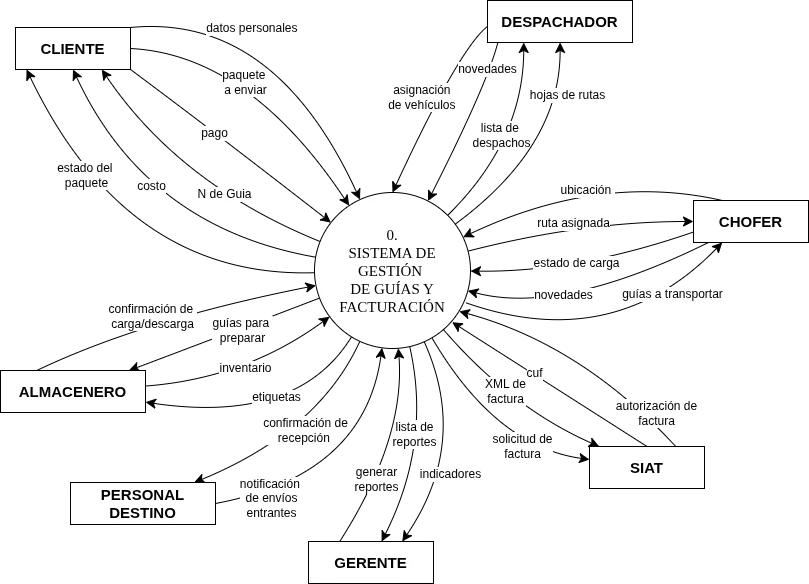
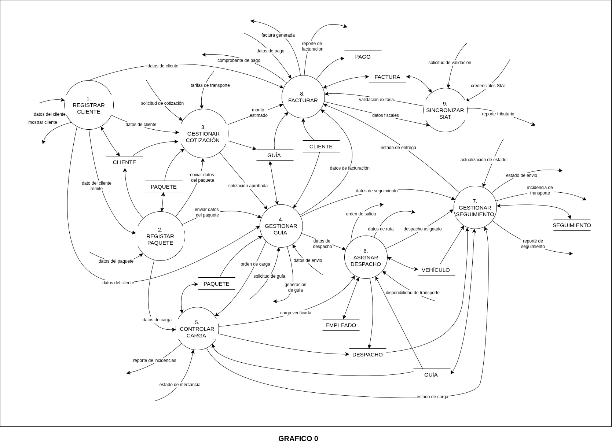
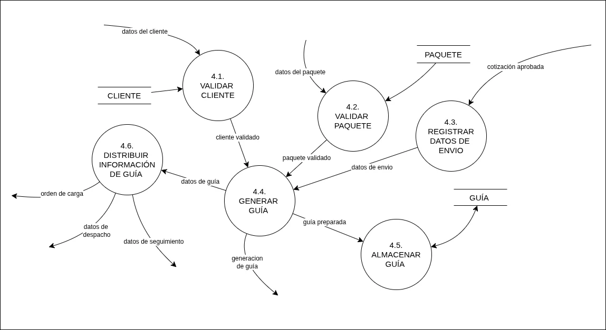
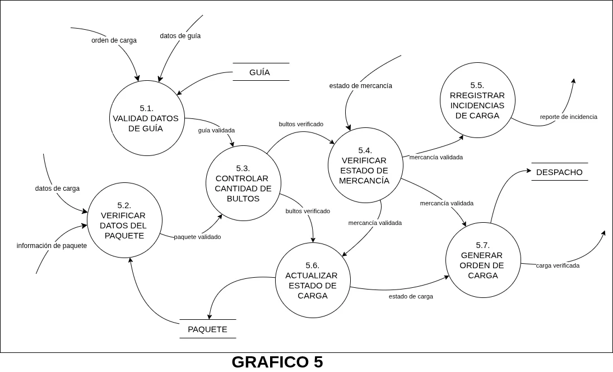
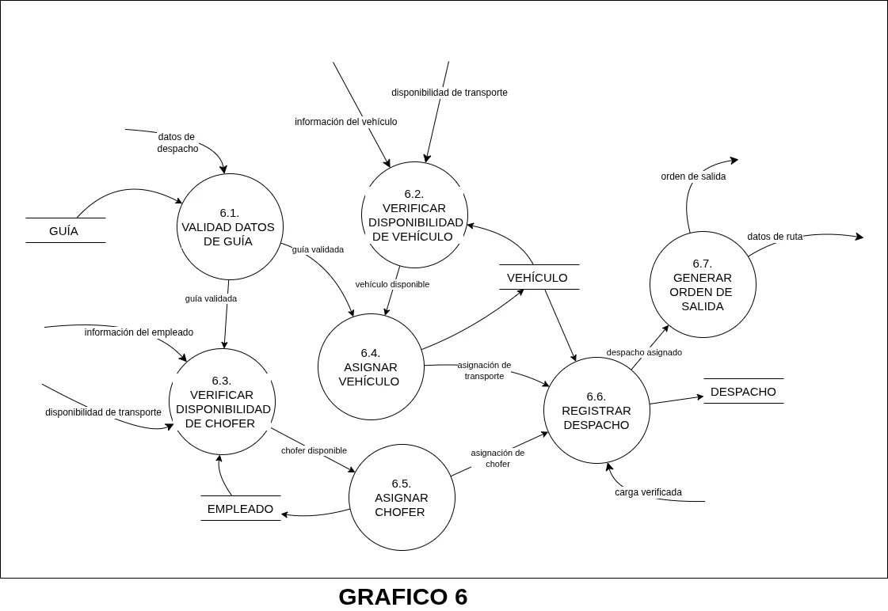
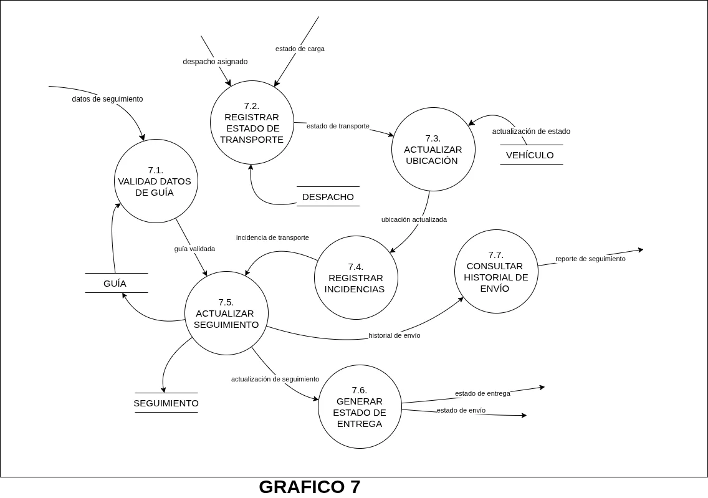
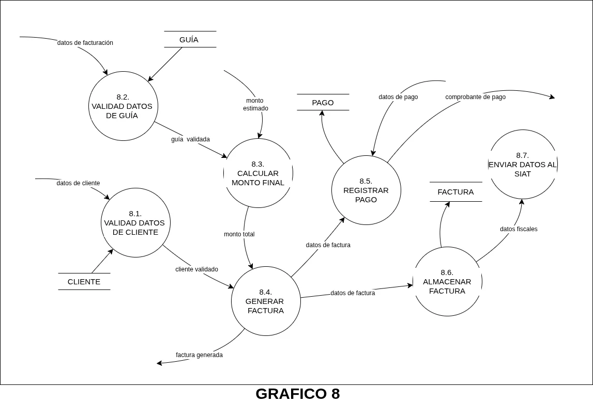
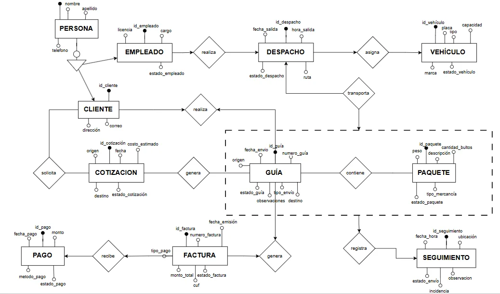

import { Badge, Aside } from '@astrojs/starlight/components';

<Badge text="Sistema actual" color="neutral" /> <Badge text="Problemas" color="caution" /> <Badge text="Propuesta" color="success" /> <Badge text="Modelo esencial" color="accent" />

## Descripción del sistema actual

Procedimientos mayormente manuales con documentos físicos y hojas de cálculo. El cliente solicita servicio → cotización → pedido (anticipo para casuales) → guía física → asignación manual de chofer/vehículo → verificación en almacén → traslado → entrega → facturación. Hay registro reiterado de información.

## Análisis de problemas

- **Registro repetitivo:** duplicidad en cotizaciones, pedidos, guías y facturación.
- **Descentralización:** información dispersa, sin acceso centralizado.
- **Dependencia manual:** controles manuales, cuellos de botella.
- **Dificultad de control:** seguimiento vía telefónica, sin estados en tiempo real.
- **Riesgo en facturación:** desconexión entre registros de carga y pedidos.

## Descripción del sistema propuesto

Sistema web centralizado con: registro de clientes y cotizaciones → aprobación → generación automática de pedido y guía → validación de anticipo (casuales) o contrato (empresa) → asignación de chofer/vehículo → estados: Cargado, En Ruta, Arribado, Entregado, Incidenciado → BD centralizada → facturación electrónica con SIAT (obtención de CUF).

## Reglas de negocio (resumen)

  <table class="min-w-full divide-y divide-zinc-800 text-sm text-zinc-300">
    <thead class="bg-zinc-900/80 text-zinc-100 font-semibold"><tr><th class="px-4 py-3 text-left">ID</th><th class="px-4 py-3 text-left">Regla</th></tr></thead>
    <tbody class="divide-y divide-zinc-800/60">
      <tr><td class="px-4 py-3">RN-01</td><td class="px-4 py-3">Todo pedido debe tener cliente registrado.</td></tr>
      <tr><td class="px-4 py-3">RN-02</td><td class="px-4 py-3">Clasificación: casuales / empresa.</td></tr>
      <tr><td class="px-4 py-3">RN-03</td><td class="px-4 py-3">Casuales: anticipo antes de la guía.</td></tr>
      <tr><td class="px-4 py-3">RN-04</td><td class="px-4 py-3">Empresa: contrato vigente para pago diferido.</td></tr>
      <tr><td class="px-4 py-3">RN-05</td><td class="px-4 py-3">Pedido debe originarse de cotización aceptada.</td></tr>
      <tr><td class="px-4 py-3">RN-06</td><td class="px-4 py-3">No hay guía sin pedido aprobado.</td></tr>
      <tr><td class="px-4 py-3">RN-07</td><td class="px-4 py-3">Guía debe tener chofer y vehículo asignados.</td></tr>
      <tr><td class="px-4 py-3">RN-08</td><td class="px-4 py-3">Verificación de carga por almacenero de origen.</td></tr>
      <tr><td class="px-4 py-3">RN-09</td><td class="px-4 py-3">Estados: Cargado, En ruta, Arribado, Entregado, Incidenciado.</td></tr>
      <tr><td class="px-4 py-3">RN-10</td><td class="px-4 py-3">Confirmar entrega antes de facturar.</td></tr>
      <tr><td class="px-4 py-3">RN-11</td><td class="px-4 py-3">Facturas emitidas vía SIAT con validación.</td></tr>
      <tr><td class="px-4 py-3">RN-12</td><td class="px-4 py-3">Casuales: completar pago pendiente al finalizar.</td></tr>
      <tr><td class="px-4 py-3">RN-13</td><td class="px-4 py-3">Empresa: acumulan saldos según contrato.</td></tr>
      <tr><td class="px-4 py-3">RN-14</td><td class="px-4 py-3">Historial de cotizaciones, pedidos, guías, viajes, facturas.</td></tr>
    </tbody>
  </table>

## Modelo esencial

### Modelo ambiental

**Declaración de propósitos:** centralizar y automatizar flujos comerciales, operativos y de facturación.

**Diagrama de contexto:**

*Figura 5: Diagrama de contexto*

**Acontecimientos:** solicitud de cotización, aceptación, pago anticipo, asignación de recursos, verificación de carga, actualización de ubicación, confirmación de recepción, solicitud de reportes, envío XML a SIAT, retorno de CUF.

### Modelo de comportamiento (DFD)

**DFD Nivel 1 – Sistema completo:**

*Figura 6: DFD Nivel 1 – Macroprocesos*

**DFD Nivel 2 (desglose):**

#### Proceso 4: Gestionar Guía

*Figura 7: DFD Nivel 2 – Gestionar Guía*

#### Proceso 5: Controlar Carga

*Figura 8: DFD Nivel 2 – Controlar Carga*

#### Proceso 6: Asignar Despacho

*Figura 9: DFD Nivel 2 – Asignar Despacho*

#### Proceso 7: Gestionar Seguimiento

*Figura 10: DFD Nivel 2 – Gestionar Seguimiento*

#### Proceso 8: Facturar

*Figura 11: DFD Nivel 2 – Facturar*

### Modelo entidad-relación

*Figura 12: Diagrama entidad-relación de la base de datos centralizada*

### Diccionario de datos (resumen)

  <table class="min-w-full divide-y divide-zinc-800 text-sm text-zinc-300">
    <thead class="bg-zinc-900/80 text-zinc-100 font-semibold"><tr><th class="px-4 py-3 text-left">Entidad</th><th class="px-4 py-3 text-left">Atributos clave</th></tr></thead>
    <tbody class="divide-y divide-zinc-800/60">
      <tr><td class="px-4 py-3">PERSONA</td><td class="px-4 py-3">idPersona (PK), ci, nombre, apellido, telefono</td></tr>
      <tr><td class="px-4 py-3">CLIENTE</td><td class="px-4 py-3">idCliente (PK), direccion, correo (hereda)</td></tr>
      <tr><td class="px-4 py-3">EMPLEADO</td><td class="px-4 py-3">idEmpleado (PK), cargo, licencia, estado</td></tr>
      <tr><td class="px-4 py-3">COTIZACION</td><td class="px-4 py-3">idCotizacion (PK), fecha, origen, destino, costoEstimado, estadoCotizacion, idCliente (FK)</td></tr>
      <tr><td class="px-4 py-3">GUIA</td><td class="px-4 py-3">idGuia (PK), numeroGuia, fechaEnvio, origen, destino, estadoGuia, tipoEnvio, idCliente (FK), idDespacho (FK)</td></tr>
      <tr><td class="px-4 py-3">PAQUETE</td><td class="px-4 py-3">idPaquete (PK), descripción, peso, cantidadBultos, tipoMercancia, estadoPaquete, idGuía (FK)</td></tr>
      <tr><td class="px-4 py-3">DESPACHO</td><td class="px-4 py-3">idDespacho (PK), fechaSalida, horaSalida, ruta, estadoDespacho, idVehículo (FK)</td></tr>
      <tr><td class="px-4 py-3">VEHICULO</td><td class="px-4 py-3">idVehiculo (PK), placa, tipo, capacidad, marca, estadoVehiculo</td></tr>
      <tr><td class="px-4 py-3">SEGUIMIENTO</td><td class="px-4 py-3">idSeguimiento (PK), fechaHora, ubicacion, estadoEnvio, observacion, incidencia</td></tr>
      <tr><td class="px-4 py-3">FACTURA</td><td class="px-4 py-3">idFactura (PK), numeroFactura, fechaEmision, montoTotal, cuf, estadoFactura, tipoPago</td></tr>
      <tr><td class="px-4 py-3">PAGO</td><td class="px-4 py-3">idPago (PK), fechaPago, monto, metodoPago, estadoPago, idFactura (FK)</td></tr>
    </tbody>
  </table>

<Aside type="note">El modelo esencial representa la lógica pura del sistema, sin restricciones tecnológicas.</Aside>