import { Badge, Aside } from '@astrojs/starlight/components';

<Badge text="UML" color="accent" /> <Badge text="BPMN" color="neutral" /> <Badge text="Casos de uso" color="success" />

## Modelo de clases UML

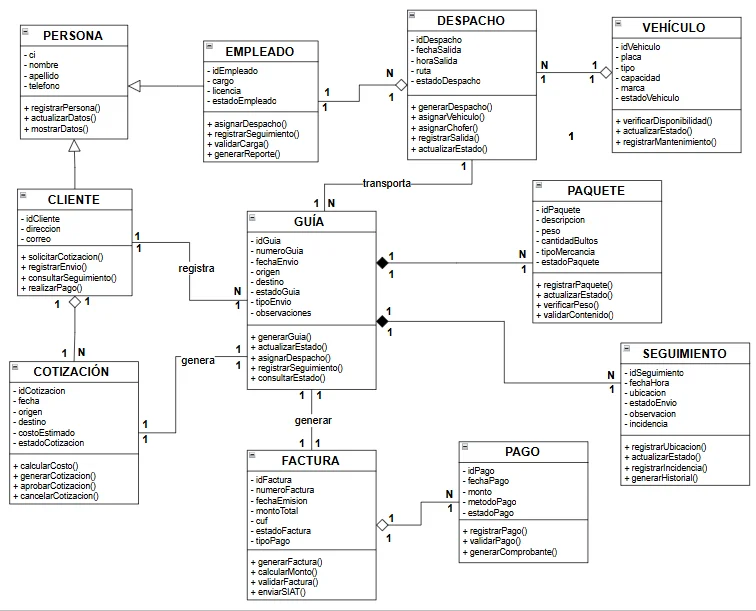
*Figura 13: Diagrama de clases UML del sistema*

## Modelado con BPMN

### Proceso actual

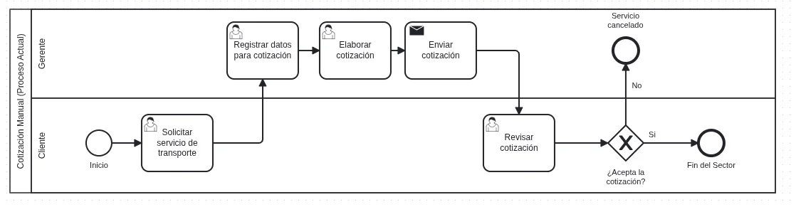
*Figura 14: BPMN – Cotización manual (proceso actual)*

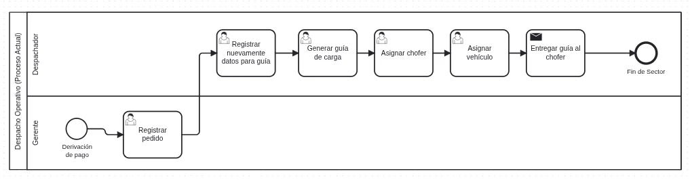
*Figura 15: BPMN – Despacho operativo (proceso actual)*

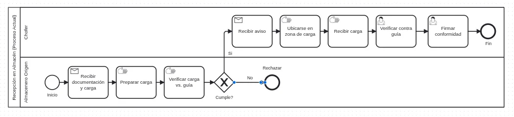
*Figura 16: BPMN – Recepción en almacén (proceso actual)*

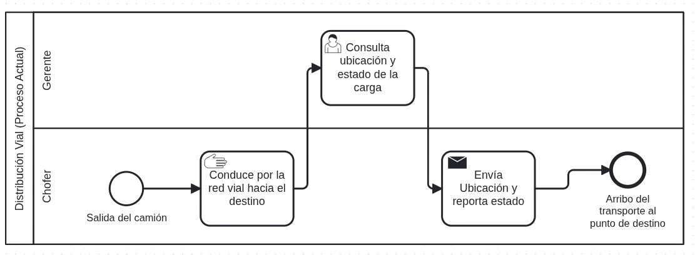
*Figura 17: BPMN – Distribución vial (proceso actual)*

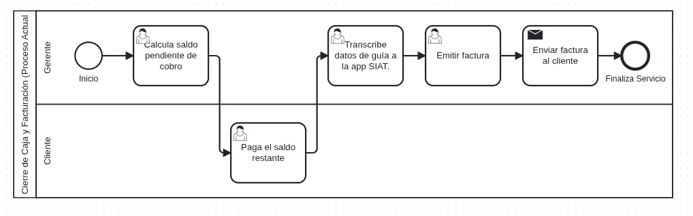
*Figura 18: BPMN – Cierre de caja y facturación (proceso actual)*

### Proceso propuesto

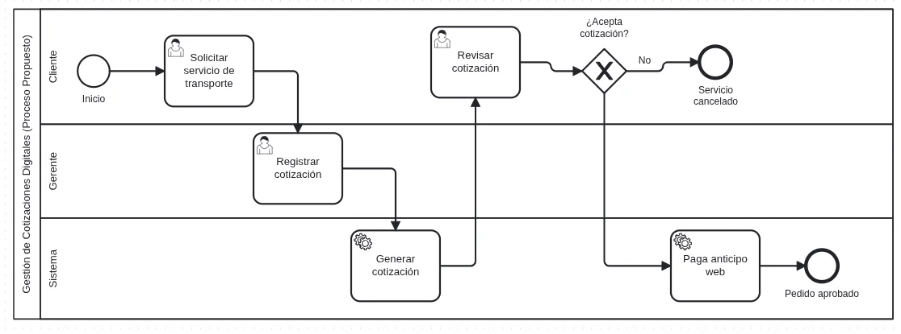
*Figura 19: BPMN – Gestión de cotizaciones digitales*

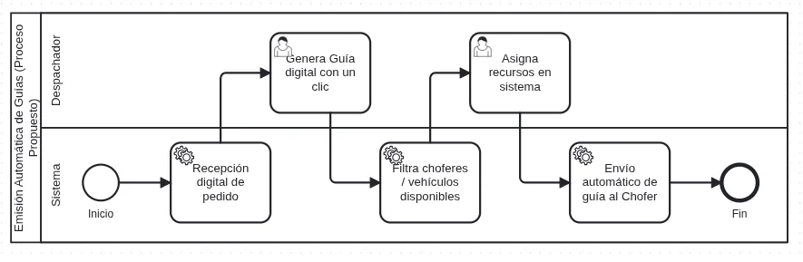
*Figura 20: BPMN – Emisión automática de guías*

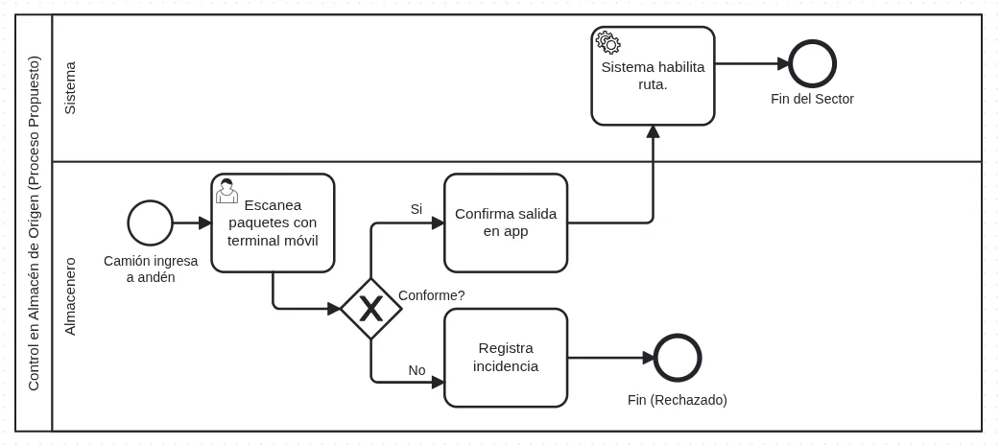
*Figura 21: BPMN – Control digital de almacén*

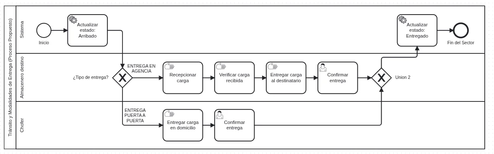
*Figura 22: BPMN – Tránsito y entregas*

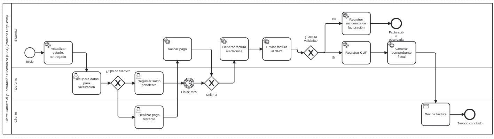
*Figura 23: BPMN – Integración y facturación SIAT*

## Interacciones dinámicas

El diagrama de secuencia para facturación electrónica (ver Anexo D) muestra el intercambio de mensajes entre interfaz web, reglas de negocio, SIAT y base de datos.

## Casos de uso

### Casos de uso de negocio

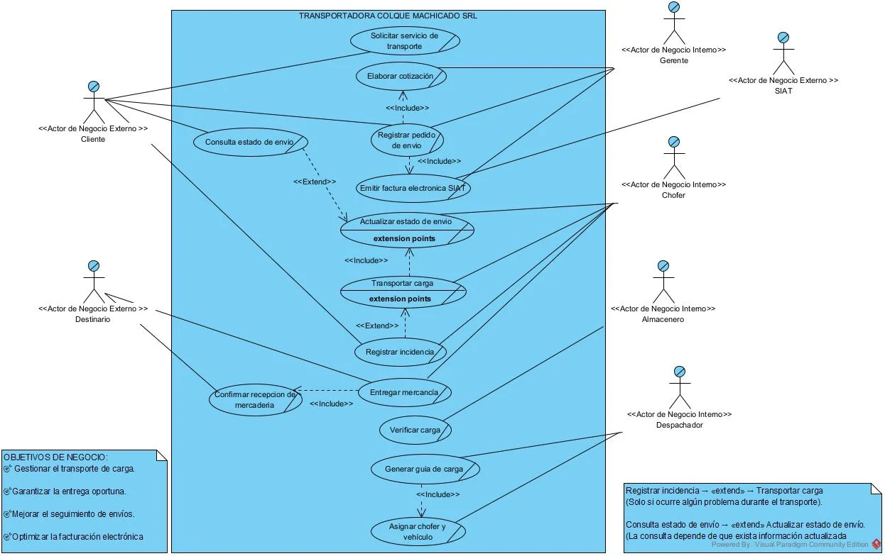
*Figura 24: Diagrama de casos de uso de negocio*

### Casos de uso de sistema

#### Módulo de facturación e integración SIAT
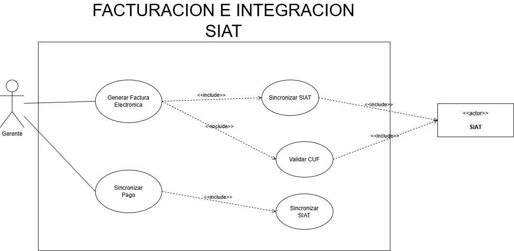
*Figura 25: Casos de uso – Facturación e integración SIAT*

#### Módulo de cotizaciones y pedidos
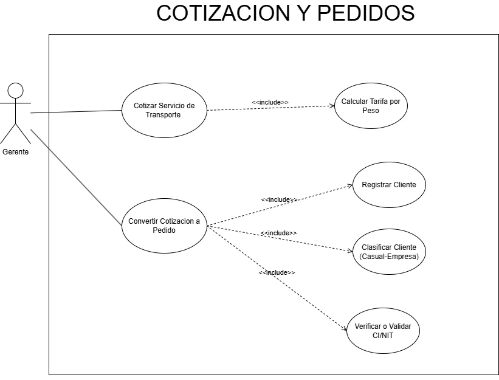
*Figura 26: Casos de uso – Cotizaciones y pedidos*

#### Módulo de guías y despachos
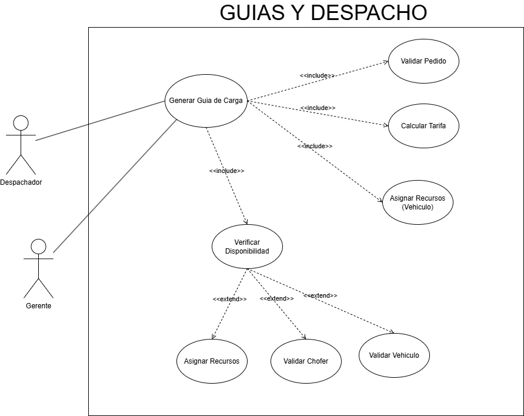
*Figura 27: Casos de uso – Guías y despacho*

#### Módulo de control operativo y almacén
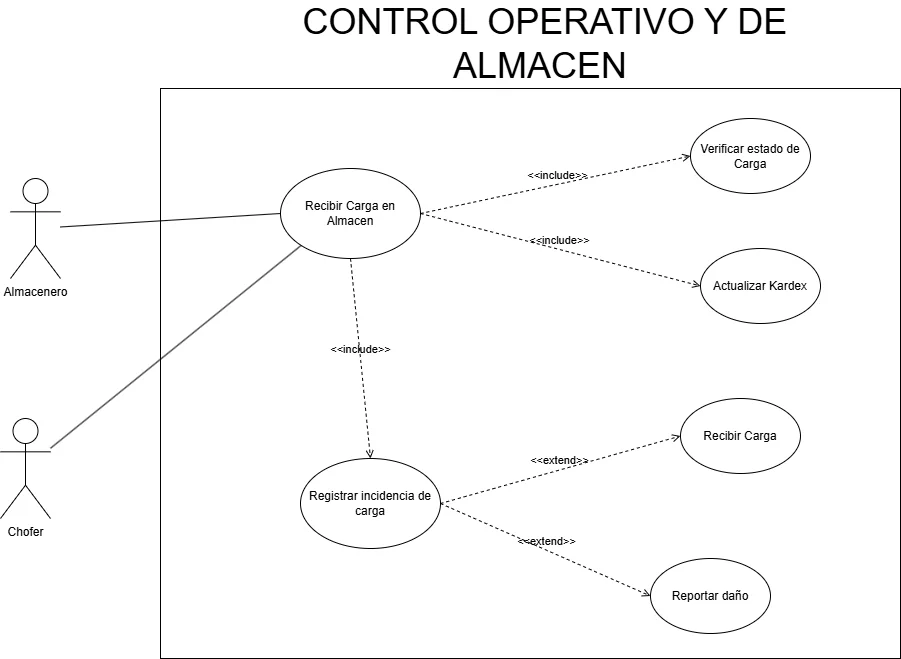
*Figura 28: Casos de uso – Control operativo y de almacén*

### Casos de uso en texto

**Alto nivel:**
- Caso de uso: Generar Factura
- Actores: Gerente, SIAT
- Descripción: El gerente genera la factura electrónica una vez confirmada la entrega, valida datos, envía a SIAT y obtiene CUF.

**Expandido:** Precondiciones (entrega confirmada, cliente registrado, anticipo pagado si es casual). Secuencia normal: solicitar factura → verificar estado Entregado → confirmar datos → calcular monto → generar XML → enviar a SIAT → recibir CUF → almacenar factura. Cursos alternos: saldo pendiente (solicitar pago), SIAT no responde (reintentar hasta 3 veces, luego marcar pendiente).

<Aside type="tip">Los casos de uso en texto expandido detallan los flujos principales y excepciones para guiar la implementación futura.</Aside>