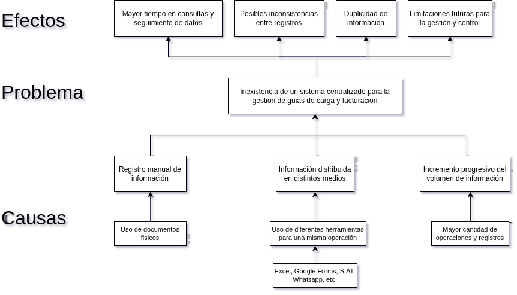
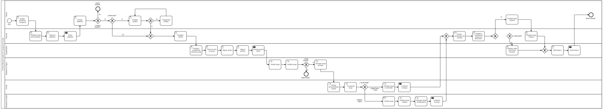
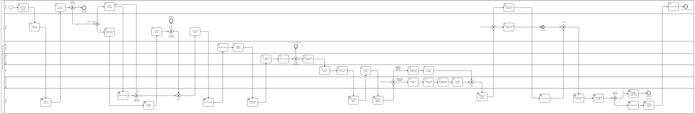
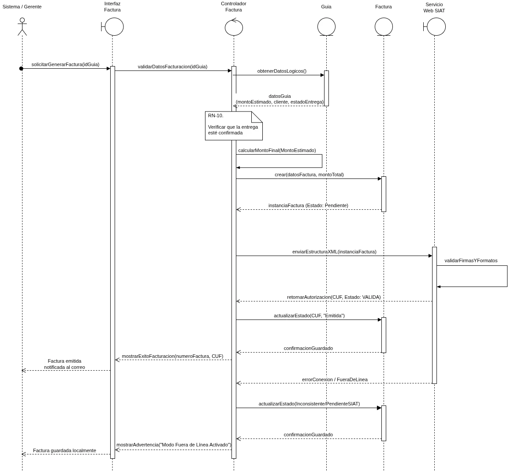

# Anexos

## Anexo A – Árbol de problemas

---
**Descripción:**  
El árbol de problemas es una herramienta de análisis que permite identificar de manera estructurada el **problema central** (inexistencia de un sistema centralizado para la gestión de guías y facturación), sus **causas** (registro repetitivo, administración descentralizada, dependencia de procesos manuales, etc.) y sus **efectos** (inconsistencia de información, retrasos operativos, baja trazabilidad, etc.). Este diagrama sirvió como base para definir los objetivos del proyecto y orientar la solución propuesta.

## Anexo B – Diagrama BPMN actual (completo)

**Descripción:**  
Este diagrama representa el **flujo completo del proceso actual** de gestión de guías y facturación en Transportadora Colque Machicado SRL, utilizando notación BPMN (Business Process Model and Notation). Muestra la interacción entre los actores (cliente, gerente, despachador, almacenero, chofer) y las actividades manuales actuales: cotización en papel, registro de pedidos, emisión de guías físicas, asignación manual de recursos, verificación de carga, distribución vial con seguimiento telefónico y cierre de caja con facturación manual. Este modelo evidencia los cuellos de botella y la falta de integración entre las etapas.

---

## Anexo C – Diagrama BPMN propuesto (completo)

**Descripción:**  
El diagrama BPMN del **proceso propuesto** muestra el flujo optimizado tras la implementación del sistema de información centralizado. Incluye: cotización digital con cálculo automático de tarifas, generación automática de pedidos y guías, asignación de chofer/vehículo desde el sistema, control de carga con dispositivos móviles, seguimiento en tiempo real con actualización de estados (Cargado, En ruta, Entregado, etc.), y facturación electrónica integrada con SIAT (obtención del Código Único de Facturación). Este modelo refleja la reducción de tareas manuales y la mejora en la trazabilidad y eficiencia operativa

---

## Anexo D – Diagrama de secuencia (facturación electrónica)

**Descripción:**  
El diagrama de secuencia UML detalla la **interacción temporal entre los objetos del sistema** durante el proceso de facturación electrónica. Muestra cronológicamente cómo el gerente (o el sistema) solicita la generación de una factura, el sistema valida los datos de la guía y el cliente, calcula el monto total, genera el archivo XML según el formato SIAT, envía la solicitud al Servicio de Impuestos Nacionales (SIN), recibe el CUF (Código Único de Facturación) y finalmente almacena la factura como emitida. También incluye cursos alternos, como reintentos en caso de falla de conexión con el SIAT. Este diagrama es fundamental para comprender la integración técnica con la plataforma tributaria